# 🎬 Video Manual Interactivo — LMA Control

Recorrido visual completo por la aplicación **LMA Control** para los tres roles del sistema.

---

## 🔐 Pantalla de Login

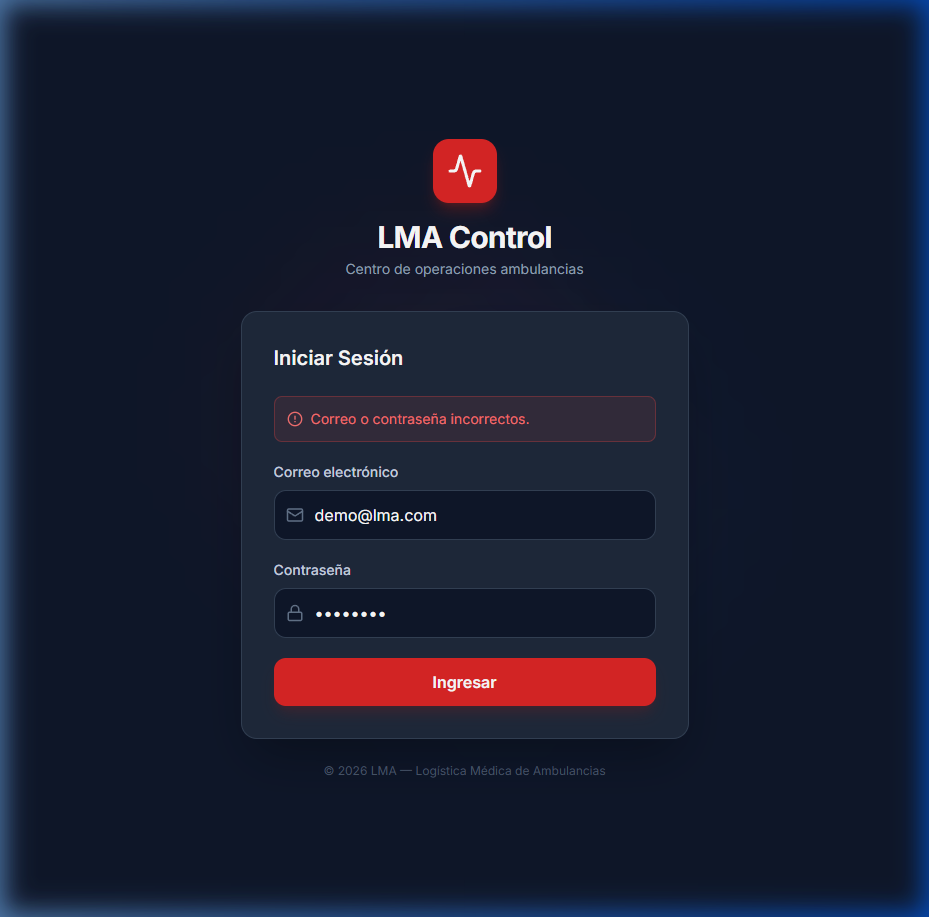

---

## 🟢 Rol: Administrador General

**Usuario:** `ejemplo@lma.com` · **Acceso:** Todos los módulos

### Video del recorrido completo

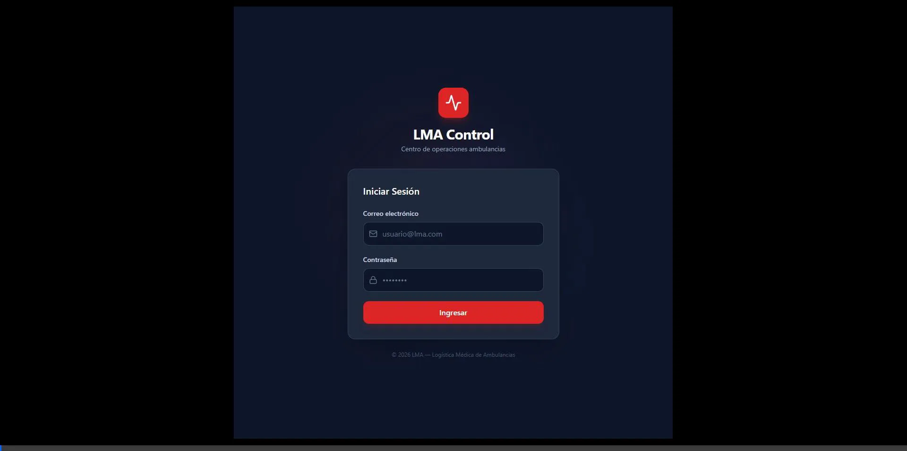

### Capturas de cada módulo

#### Dashboard — Bandeja de Triage + Monitor de Flota
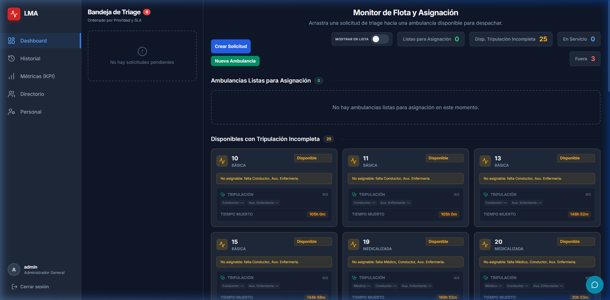

#### Historial y Control de Servicios
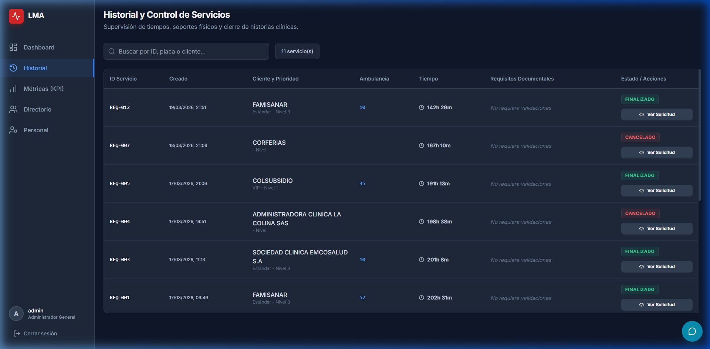

#### Métricas de Operación — KPIs y Desglose por Móvil
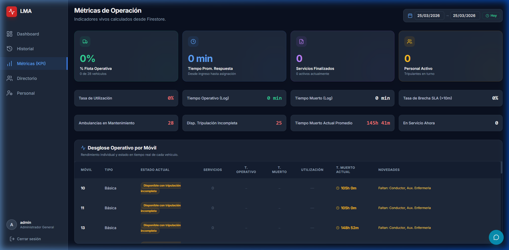

#### Directorio de Clientes
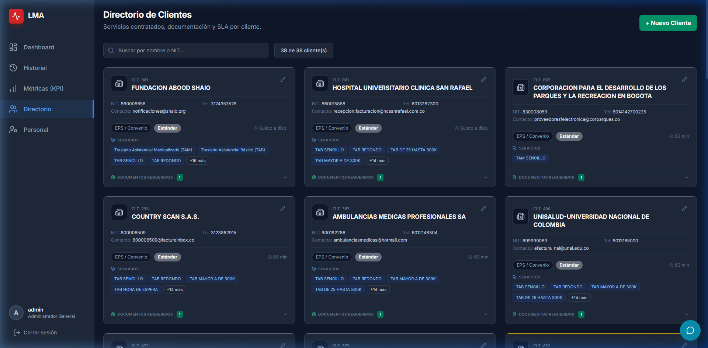

#### Personal — Turnos en Vivo
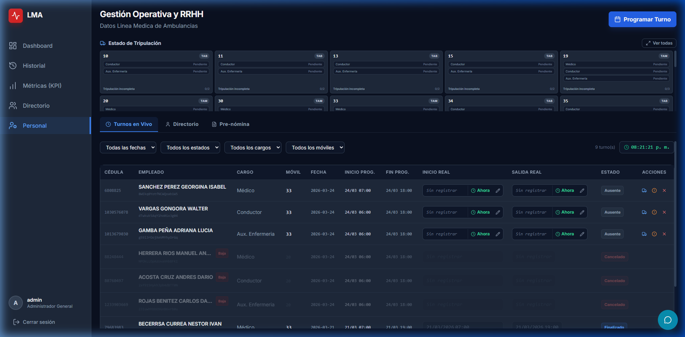

#### Personal — Directorio de Empleados
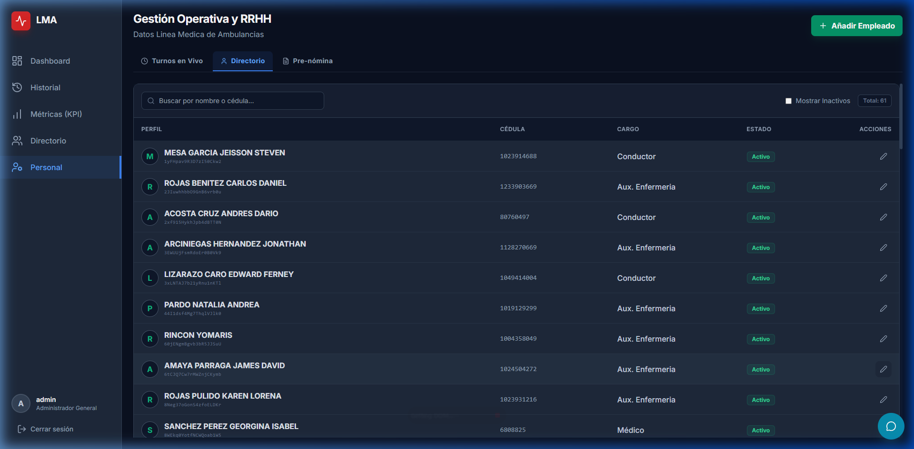

#### Personal — Pre-nómina
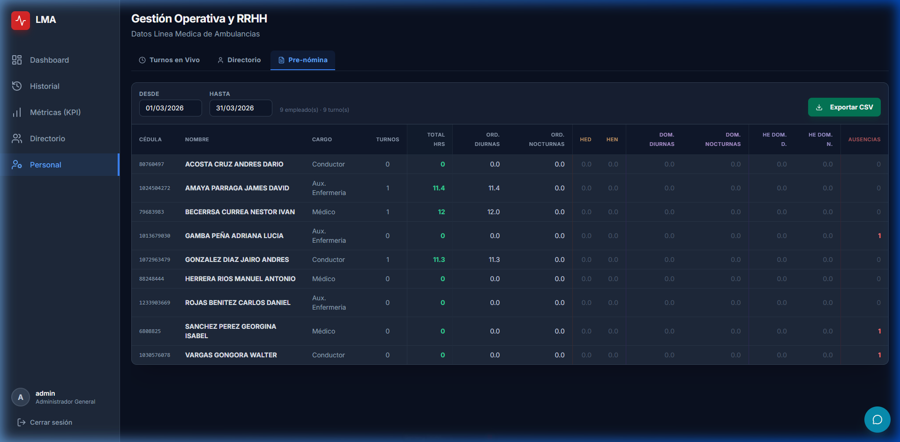

> **Nota:** El Administrador General es el **único rol** que puede crear ambulancias nuevas (botón "Nueva Ambulancia") y acceder al panel de Métricas (KPI).

---

## 🔵 Rol: Controlador

**Usuario:** `ejemplo@lma.com` · **Acceso:** Dashboard, Historial, Directorio

### Módulos visibles en el sidebar
| Módulo | Disponible |
|--------|:----------:|
| Dashboard | ✅ |
| Historial | ✅ |
| Métricas (KPI) | ❌ |
| Directorio | ✅ |
| Personal | ❌ |

---

### 📋 Sección 1: Crear Solicitud de Servicio

El controlador crea nuevas solicitudes desde el Dashboard usando el botón **"Crear Solicitud"**.

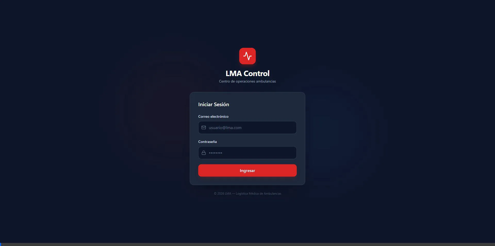

#### Modal "Crear orden de servicio" — Pestaña Orden de Servicio
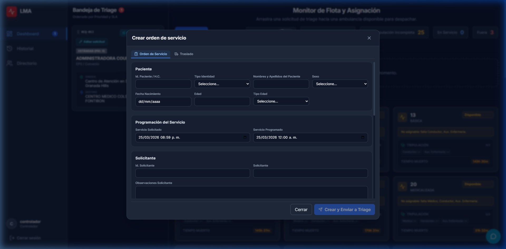

#### Pestaña "Traslado" — Diagnóstico CIE, Estado Clínico, Origen y Destino
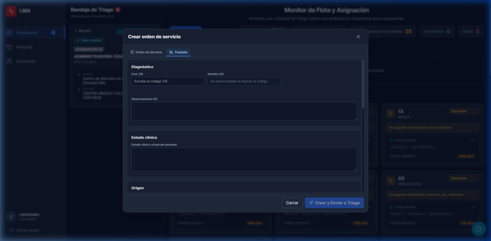

**Pasos del flujo:**
1. Clic en **"Crear Solicitud"** (botón azul en el Dashboard)
2. Completar la pestaña **Orden de Servicio**: datos del paciente, programación, entidad
3. Pasar a la pestaña **Traslado**: diagnóstico CIE, origen, destino
4. Clic en **"Crear y Enviar a Triage"** para confirmar

---

### 📋 Sección 2: Asignación de Solicitud (Drag & Drop)

El controlador asigna solicitudes de la Bandeja de Triage a ambulancias disponibles arrastrando la tarjeta.

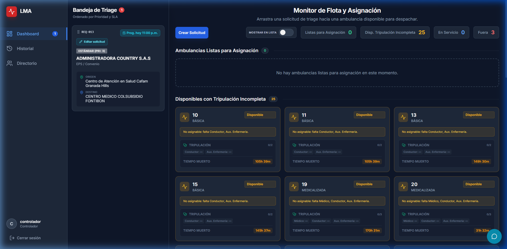

**Pasos del flujo:**
1. En la **Bandeja de Triage** (panel izquierdo), seleccione la tarjeta de solicitud
2. **Arrastre** la tarjeta hacia una ambulancia con estado "Lista para Asignación"
3. **Suelte** la tarjeta sobre la ambulancia (ej. Ambulancia 38)
4. El sistema confirma la asignación si la tripulación está completa

> **⚠️ Advertencia:** Solo se puede asignar a ambulancias con **tripulación completa**. Si la tripulación está incompleta, aparecerá un error.

---

### 📋 Sección 3: Ver Solicitud en Historial

El controlador consulta los detalles de cualquier servicio registrado.

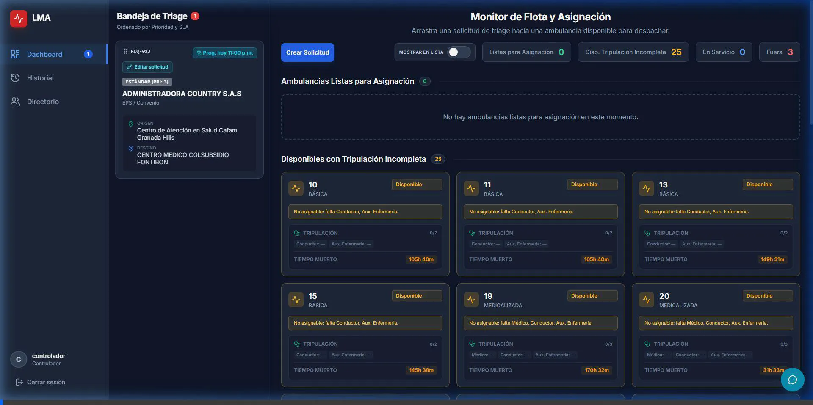

**Pasos del flujo:**
1. Clic en **"Historial"** en el sidebar
2. Localice el servicio deseado en la tabla (use la barra de búsqueda si es necesario)
3. Clic en el botón **"Ver Solicitud"** (ícono de ojo 👁️) en la columna de acciones
4. Se abre el modal con todos los detalles de la solicitud: paciente, entidad, origen, destino, tiempos

---

### 📋 Sección 4: Finalizar Servicio

El controlador cierra un servicio completado desde el Historial.

**Pasos del flujo:**
1. En **Historial**, localice el servicio a cerrar
2. Clic en el botón de **cierre** (ícono de check ✓) en la columna de acciones
3. Se abre el **Modal de Cierre** con el checklist de verificación documental
4. Marque cada ítem del checklist conforme esté completado
5. Clic en **"Confirmar Cierre"** para finalizar

> **⚠️ Importante:** Un servicio no puede cerrarse si tiene un cambio de estado pendiente de aprobación.

---

### 📋 Sección 5: Ver Detalle de Cliente en Directorio

El controlador consulta la información de entidades/clientes registrados.

**Pasos del flujo:**
1. Clic en **"Directorio"** en el sidebar
2. Se muestran las tarjetas de los 38 clientes registrados
3. Clic en cualquier tarjeta de cliente (ej. **FUNDACION ABOOD SHAIO**)
4. Se expanden los detalles: NIT, contacto, teléfono, servicios contratados, documentos requeridos, SLA

---

## 🟡 Rol: Recurso Humano (RH)

**Usuario:** `ejemplo@lma.com` · **Acceso:** Solo Personal

### Módulos visibles en el sidebar
| Módulo | Disponible |
|--------|:----------:|
| Dashboard | ❌ |
| Historial | ❌ |
| Métricas (KPI) | ❌ |
| Directorio | ❌ |
| Personal | ✅ |

### Video del recorrido completo RH

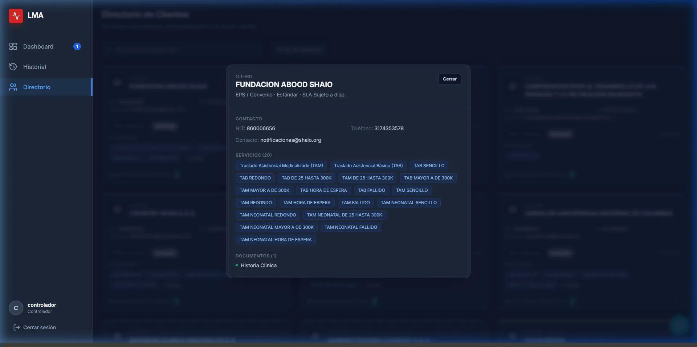

---

### 📋 Sección 1: Programar Turno

El RH programa turnos para el personal asignándolos a ambulancias específicas.

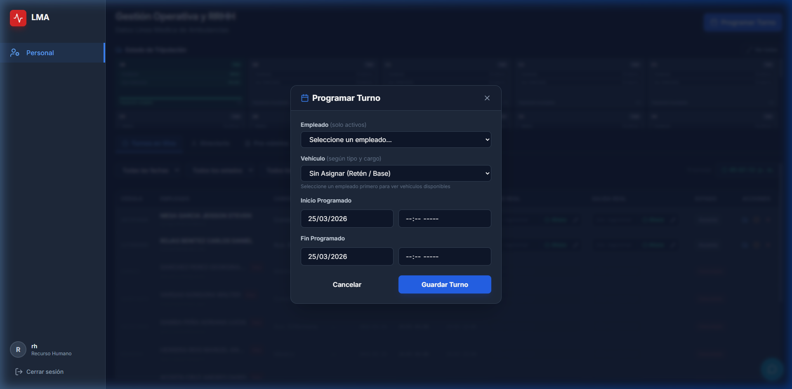

**Pasos del flujo (ejemplo: ambulancia 10):**
1. En **Turnos en Vivo**, clic en **"Programar Turno"** (botón azul, esquina superior derecha)
2. En el modal, seleccionar **Empleado**: AMAYA PARRAGA JAMES DAVID
3. Seleccionar **Vehículo**: Ambulancia 10 (aparece según compatibilidad de cargo)
4. Configurar **Inicio Programado**: fecha y hora de inicio
5. Configurar **Fin Programado**: fecha y hora de fin
6. Clic en **"Guardar Turno"**
7. Repetir para GONZALEZ DIAZ JAIRO ANDRES

> **⚠️ Advertencia:** El sistema valida automáticamente: **solapamiento** de turnos, **compatibilidad de cargo** con el tipo de ambulancia, y **cupo disponible**.

---

### 📋 Sección 2: Ver Toda la Flota

El RH puede ver el estado completo de tripulación de todas las ambulancias.

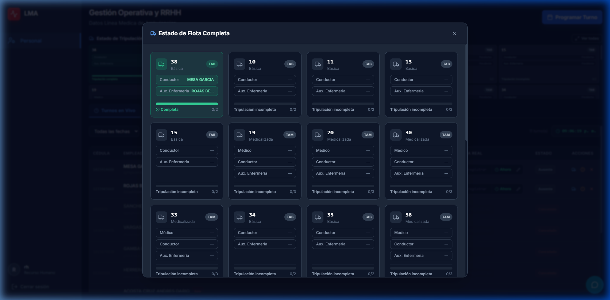

**Pasos del flujo:**
1. En **Turnos en Vivo**, busque la sección **"Estado de Tripulación"** en la parte superior
2. Clic en el botón **"Ver todas"** (esquina superior derecha, junto a "Estado de Tripulación")
3. Se abre el modal **"Estado de Flota Completa"** mostrando:
   - Cada ambulancia con su número, tipo (TAB/TAM)
   - Personal asignado por rol (Conductor, Aux. Enfermería, Médico)
   - Barra de progreso de completitud (verde = completa)
   - Contador de tripulación (ej. 2/2 = completa, 0/3 = vacía)

> **💡 Tip:** La ambulancia **38** es la única con tripulación completa (MESA GARCIA como Conductor + ROJAS BE... como Aux. Enfermería).

---

### 📋 Sección 3: Añadir Empleado

El RH registra nuevo personal en el directorio de empleados.

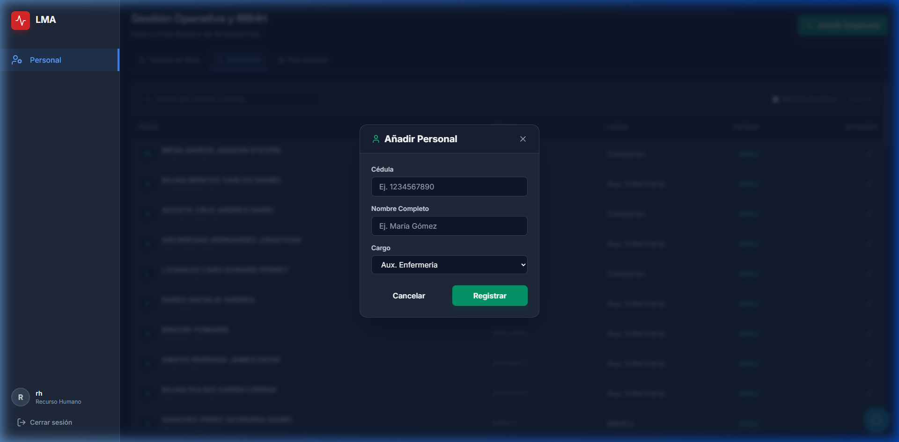

**Pasos del flujo:**
1. En la sub-pestaña **"Directorio"** de Personal, clic en **"Añadir Empleado"** (botón verde)
2. Se abre el modal **"Añadir Personal"** con los campos:
   - **Cédula**: Número de identificación único (ej. 1234567890)
   - **Nombre Completo**: Nombre y apellidos (ej. María Gómez)
   - **Cargo**: Seleccionar de la lista (Aux. Enfermería, Conductor, Médico, Paramédico)
3. Clic en **"Registrar"** para guardar

> **Nota:** El sistema valida que **no exista otro empleado con la misma cédula** antes de registrar.

---

### 📋 Sección 4: Pre-nómina y Exportar CSV

El RH consulta el desglose de horas trabajadas y exporta los datos.

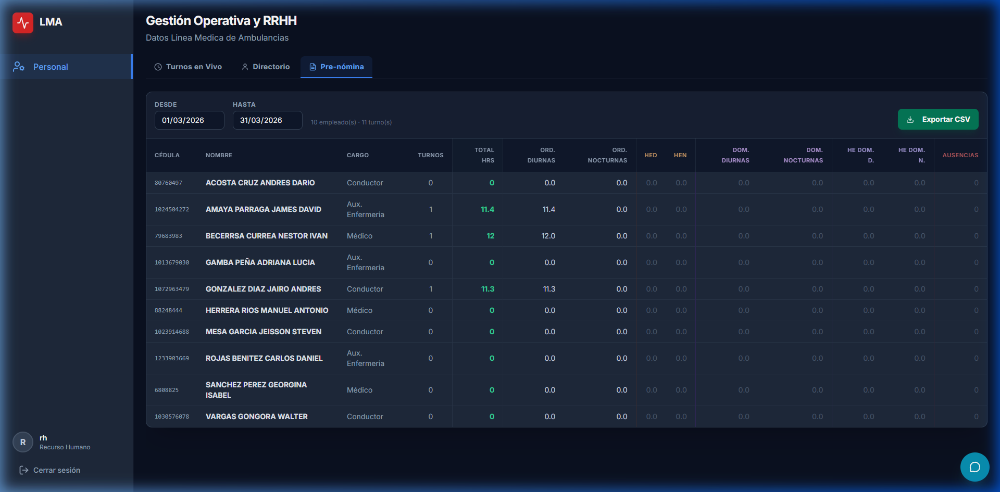

**Pasos del flujo:**
1. Clic en la sub-pestaña **"Pre-nómina"** de Personal
2. Configurar el rango de fechas (**DESDE** / **HASTA**) para el período de nómina
3. Se calcula automáticamente para cada empleado:
   - Total de horas, Ordinarias Diurnas/Nocturnas
   - Horas Extra Diurnas/Nocturnas (HED/HEN)
   - Dominicales Diurnas/Nocturnas
   - Horas Extra Dominicales Diurnas/Nocturnas
   - Ausencias
4. Clic en **"Exportar CSV"** (botón verde, esquina superior derecha) para descargar

> **💡 Tip:** Se consideran **horas extra** cuando el fin real del turno excede el programado por más de 30 minutos. Los **festivos colombianos** (Ley Emiliani) se calculan automáticamente.

---

## Resumen Comparativo de Permisos

| Módulo | RH | Controlador | Admin General |
|--------|:--:|:-----------:|:-------------:|
| Dashboard | ❌ | ✅ | ✅ |
| Historial | ❌ | ✅ | ✅ |
| Métricas (KPI) | ❌ | ❌ | ✅ |
| Directorio | ❌ | ✅ | ✅ |
| Personal | ✅ | ❌ | ✅ |
